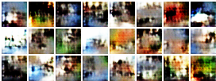
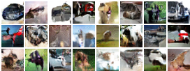
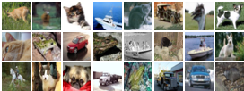
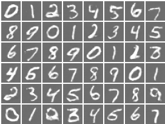

# GAN_zoo

## Generative Adverasial Nets(GAN)

GAN has been the most popular generative model in this world. 
Here is an implement in PyTorch.

## Prerequistes
* Python 2.7 or Python 3.4+
* [PyTorch](http://pytorch.org/)
* [Jupyter](http://jupyter.org/)

## Usage
$ First update is two simple interaction version in `Jupyter Notebook`. You can train a GAN model step by step while write down something important.

### Result of DCGAN

CIFAR10

1 epoch:

54 epoch:

real samples:

### Result of ACGAN

MNIST

7 epoch:

-------
1. Generative Adversarial Nets [GANs]:(https://arxiv.org/abs/1406.2661)

2. Unsupervised Representation Learning with Deep Convolutional Generative Adversarial Networks [DCGAN]:(https://arxiv.org/abs/1511.06434)

3. Conditional Image Synthesis With Auxiliary Classifier GANs [ACGAN]:（https://arxiv.org/pdf/1610.09585.pdf）
## Author
Chao Wang
